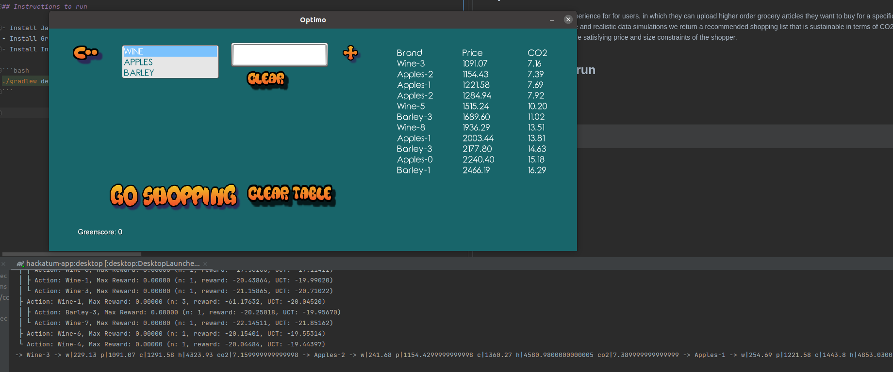

# óptimo

óptimo provides a gaming experience for for users, in which they can upload higher order grocery articles they want to buy for a specific time period. Using advanced artificial intelligence and realistic data simulations we return a recommended shopping list that is sustainable in terms of CO2 emissions and healthy for the consumer, while satisfying price and size constraints of the shopper.

## Instructions to run

- Install Java
- Install Gradle
- Install Intellij

```bash
./gradlew desktop:run
```



## External Libraries Used

This app was created via a combining [mctreesearch4j](https://github.com/aqtech-ca/mctreesearch4j) and [libGDX](https://libgdx.com/) thereby fully functional on the JVM ecosystem.

